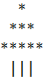
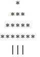

# kata-christmas-2024

**Kata 50(!!!) per l'especialitat fullstackPHP 19-12-24**

Donat un nombre enter, genera un arbre de Nadal per terminal.

**Input**

3

5

**Output**

I si el problema troncal us sembla fàcil, a vera que us inventeu per millorar això! :D :D :D 

**Bon any nou!!**